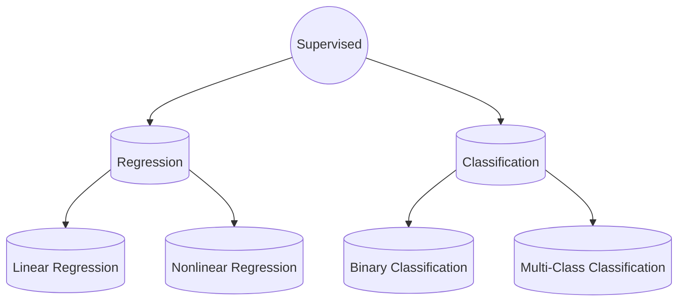

## What is Data Science? 💡

- **Definition**: `Solving problems with data`.
- **Process**: 
	  - Identify a `scientific`, `social`, or `business problem`.
	  - Translate it into a data problem.
	  - Collect & understand data.
	  - Clean & format data.
	  - Use data to create a solution.
- **Solution Methods**: `Data analysis`, `Machine learning`, or a `combination` of both.
## What is Data Analysis? 📈

- **Definition**`: Using data to discover useful information`.
- **Elements**:
	  - `Data`: Anything measurable or recordable.
	  - `Statistics`: Summarize and visualize main characteristics.
	  - `Algorithms`: Apply algorithms to find patterns.
## What is Machine Learning? 🤖

- **Definition**: `Creating and using models that learn from data`.
- **Components**:
	  - `Data`: Anything `measurable` or `recordable`.
	  - `Model`: Specification of a mathematical relationship between variables.
	  - `Evaluation`: Assessing the model's performance.

- **Quotes**:
	  - Herbert Alexander Simon: 
		  - `Learning is any process by which a system improves performance from experience.`
	  - Arthur Samuel (1959): 
		  - `The subfield of computer science that gives computers the ability to learn without being explicitly programmed.`
	  - Tom Mitchell (1997): 
		  - `A computer program is said to learn from experience E with respect to some class of tasks T and performance measure P if its performance at tasks in T, as measured by P, improves with experience E.`
	  - `Application` of artificial intelligence that involves `algorithms` and `data` that automatically `analyze` and `make decisions` without human intervention.
## Traditional Programming vs. Machine Learning 🔄

- **Difference**: `Traditional Programming` relies on human-coded instructions, while `Machine Learning` is trained using large amounts of data.

- ![[Traditional Programming vs. Machine Learning.png]]
## Types of Machine Learning 🔄

- **Supervised Learning**: Given training data `with` desired outputs.
- **Unsupervised Learning**: Given training data `without` desired outputs.
- **Semi-Supervised Learning**: Given training data and a few desired outputs.
- **Reinforcement Learning**: Learns from rewards obtained from a sequence of actions.
### **Supervised Learning 🎓**

- Learn through examples of which we know the desired output (what we want to predict).
	- Is this a cat or a dog?
	- Are these emails spam or not?
	- Predict the market value of houses.
- ![[Supervised Learning.png]]

![[Regression-Classification-1.png]]
![[Regression-Classification-2.png]]
### **Unsupervised Learning 🧩**

- There is `no desired output`; learn something about the data. `Latent relationships`.
	- I have photos and want to put them in 20 groups.
	- I want to find anomalies in the credit card usage patterns of my customers.
- The machine learns through `observation` & `finds structures` in data.
### **More Types of Machine Learning**
#### **Semi-supervised learning** 🔄

- A `mix of Supervised and Unsupervised` learning, where usually a small part of data is labeled.
#### **Reinforcement learning** 🎮

- The model learns from a `series of actions` by maximizing a reward function. 
- The reward function can either be maximized by penalizing `bad` actions `and/or` rewarding `good` actions.
	- Example: Training of `self-driving cars` using feedback from the environment.
## **Machine Learning Applications** 📱

- Image Recognition
- Speech Recognition
- Traffic Prediction
- Product Recommendations
- Self-driving Cars
- Email Spam and Malware Filtering
- Virtual Personal Assistant
- Online Fraud Detection
- Loan Decisions 
- Diagnose Patients 
- Autocompleting Texts 
- Face Detection
- ![[ML-Applications.png]]
## **Algorithm Selection Training** 🛠️
### **Supervised**
- Linear Classifier
- Naive Bayes
- Support Vector Machines (SVM)
- Decision Tree
- Random Forests
- k Nearest Neighbors
### **Neural Networks (Deep Learning)**
### **Unsupervised**
- PCA
- t-SNE
- k-means
- DBSCAN
### **Reinforcement**
- SARSA λ
- Q-Learning